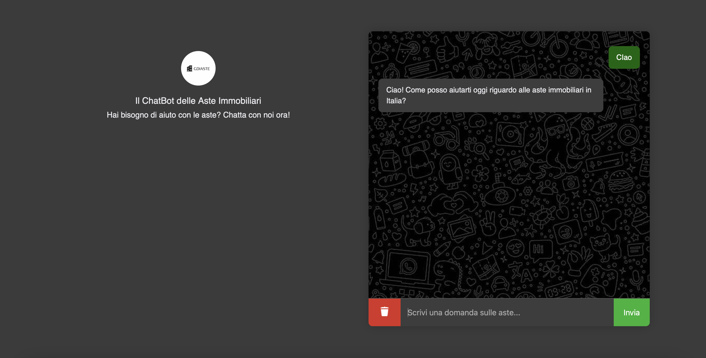

# ChatBot Aste Immobiliari 🏠🤖

Questo progetto è un assistente virtuale basato su **GPT-3.5** progettato per aiutare gli utenti a comprendere e partecipare alle **aste immobiliari italiane**.  
Sviluppato con **FastAPI** per il backend e **HTML/CSS/JS** per il frontend, il chatbot offre una UI moderna ispirata a ChatGPT e una UX intuitiva.

---

## 🚀 Funzionalità principali

- ✅ Integrazione con OpenAI GPT
- ✅ Frontend responsive in stile ChatGPT
- ✅ Risposta del bot simulata "a lettere"
- ✅ Cronologia conversazioni in memoria temporanea
- ✅ Pulsante per cancellare la cronologia
- ✅ Indicatore "sta scrivendo..."
- ✅ Design moderno e personalizzabile

---

## 🛠️ Tecnologie utilizzate

- **Python 3.12**
- **FastAPI** (backend)
- **OpenAI API**
- **HTML5 / CSS3 / JavaScript** (frontend)
- **dotenv** per la gestione sicura delle chiavi

---

## 📂 Struttura del progetto
```bash
ChatBot_Aste/
├── app/
│   ├── main.py
│   ├── config.py
│   ├── routes/
│   │   └── chat.py
│   ├── services/
│   │   └── gpt_service.py
│   └── models/
│       └── chat_request.py
├── frontend/
│   ├── index.html
│   ├── style.css
│   └── script.js
├── .env               # NON incluso nel repo (gitignore)
├── .gitignore
├── README.md
└── requirements.txt
```
---

## ▶️ Come eseguire il progetto

### 1. Clona la repo:

```bash
git clone https://github.com/fabriziomileto8/chatbot_aste_immobiliari.git
cd chatbot_aste_immobiliari
```

### 2. Crea un ambiente virtuale: 

```bash
python -m venv .venv
source .venv/bin/activate  # Su Windows: .venv\Scripts\activate
```
### 3. Installa le dipendenze:

```bash
pip install -r requirements.txt
```

### 4. Crea un file .env con la tua chiave OpenAI:

```bash
OPENAI_API_KEY=sk-xxxxx
```

### 5. Esegui il server FastAPI:

```bash
uvicorn app.main:app --reload
```
---

## 🖼️ Screenshot

### 🔹 Interfaccia


## 🎬 Demo video

🎥 [Guarda la demo](frontend/video_demo/demo.mov)

## 📫 Contatti

Se vuoi saperne di più o collaborare con me, puoi trovarmi qui:

- LinkedIn: [linkedin.com/in/fabriziomileto](https://www.linkedin.com/in/fabrizio-mileto-94681b16b/)
- GitHub: [@fabriziomileto8](https://github.com/fabriziomileto8)
- Email: fabriziomileto8@gmail.com

---

🛠️ **Progetto sviluppato con passione e caffè ☕ da Fabrizio Mileto**

Se ti è piaciuto il progetto, lascia una ⭐ al repository!